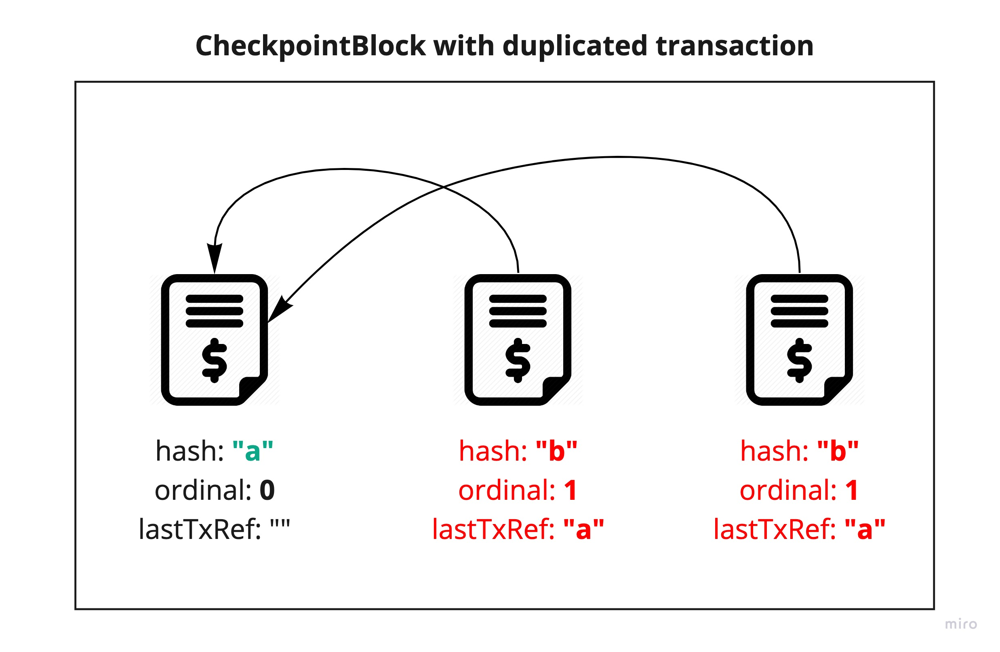

# CheckpointBlock Validation

Each transaction sent to cluster needs to be validated before proposing it to block/consensus.
Part of code responsible for validation is in `TransactionValidator.scala`.

## Duplicated transaction validation
Duplicated transaction can affect wallet balances so block which contains transaction with specific `hash` twice
is incorrect and needs to be rejected. Method `validateDuplicatedTransactions` returns `DuplicatedTransaction`
validation result if there are any duplicated transactions.

## Signature validation and hash integrity
Each block has its unique signature which is created by signing block by private key.
Thanks to that we know that block was created for sure by known signer.
Each block has also unique `hash` which is generated from the content of block so if someone malformed the content
of block - the hash should be different. If hash is different or does not match the content of block then such block
is rejected because is malformed.

## Balance validation
Balance validation checks if each of addresses could make transactions included in the block.
Of course there is a transaction validator, but some things can't be validated on single transaction level
so we need to validate whole block and all the transactions inside for specific address.

### Insufficient balance validation (for regular wallets)
First of all we must check if specific wallet has enough tokens to make all the transactions included in block.
That being said balance left after executing transactions should be `>= 0` (so can't be negative).
To do that `validateSourceAddressBalances` sums sent tokens for address and compares it with current balance.
If sum is bigger than current balance then address has `InsufficientBalance` and block is incorrect because
wallet has not enough tokens to send all the transactions from block.

### Staking amount validation (for node wallets)
Node wallets have slightly different rules of validating balance left after executing transactions.
There is a minimal amount of tokens which needs to stay untouched called **staking amount** which is currently
set to `250000` tokens (can be configured via `constellation.staking-amount`). That being said similarly to
Insufficient balance validation, after executing all the transactions for node wallet there must be a **staking amount**
of tokens left in the wallet. In case of failure it returns `InsufficientBalance`.

## Transaction integrity
Checking integrity of transactions in the block is just about validating each transaction separately in the same
way as described in [Transaction Validation](transaction-validation.md) docs.

