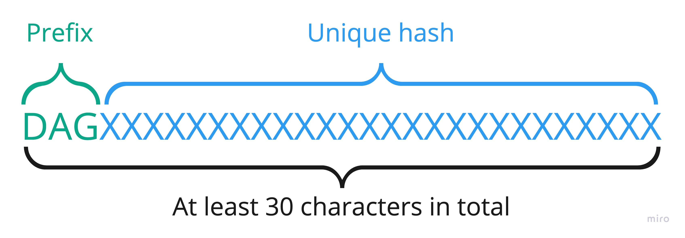
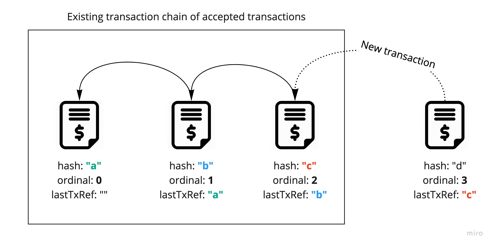

# Transaction Validation

Each transaction sent to cluster needs to be validated before proposing it to block/consensus.
Part of code responsible for validation is in `TransactionValidator.scala`.

## Source signature validation
Sender needs to sign transaction by using his private key. Signature of transaction
needs to ensure following things:

- transaction has been signed by known sender
- sender can't deny signing the transaction
- nobody altered transaction

Validation checks in collection of validation signatures about the edge called `signatureBatch` if there
is such address which equals source address and compares `hash` with `signaturesHash`

## Destination address validation
Valid destination wallet address (receiver of tokens) must match the following conditions:

- Can't be empty
- Must have `DAG` prefix
- Must have at least `30` characters length
- Must be different from source address

The validation of address emptiness happens in `validateEmptyDestinationAddress` which just checks if address is not empty.
In case of failure it returns `EmptyDestinationAddress` validation result.
If address is not empty then `validateDestinationAddress` is triggered which checks the prefix, length and compares
source address with destination address. In case of failure it returns `InvalidDestinationAddress`.

## Token amount validation
Each transaction contains information about number of tokens to transfer from source address to destination address.
The way of validating amount of token differs between dummy and non-dummy transactions.

When **dummy** transaction fails:

- Number of tokens different than `0`. It is because dummy transaction should not change any of balances so `0` is expected there.
In case of failure it returns `NonZeroAmount` validation result.

When **non-dummy** transaction fails:

- `0` tokens, in opposite to dummy transaction we must provide positive number of tokens. It causes `NonPositiveAmount`.
- Negative number of tokens. It causes `NonPositiveAmount` as well.
- Number of tokens bigger than maximum value of `Long` which causes `OverflowAmount` validation result.

Amount is validated in `validateAmount` method.

## Fee validation
For fee, we apply similar validation rules as we apply to non-dummy transactions.
Transaction does not need to have fee at all but if it exits it can't be:

- Equal to `0` (because then transaction should not include fee at all). It causes `NonPositiveAmount`.
- Negative number of tokens. It causes `NonPositiveAmount` as well.

## Duplicated transaction validation
Each transaction is unique (identified by unique hash) so sending same transaction twice should fail.
Each of nodes stores list of already accepted transactions and sending already accepted one fails with `HashDuplicateFound`.
Validation is being triggered in `validateDuplicate` method.

## Last transaction reference validation

All transactions sent from particular source address form chain structure where each transaction stores a **reference** to
previous transaction (`lastTxRef` field).
There is also `ordinal` field which stores **ordinal number** which is the index of transaction
according to the order.

That being said all the transactions need to form a chain by keeping reference to previous transaction
and incrementing the `ordinal` number. The only exception for that statement is the very first transaction
because it must have `lastTxRef` empty (because there is no previous transaction) and `ordinal` set to `0`
(because we start indexing from `0`).

Each of nodes stores information about last accepted transaction for each wallet address and validates
received one against it. Validation happens in `validateLastTransactionRef` and checks couple of things depending on
if it is first transaction or one of next ones.

For **very first** transaction:

- if `lastTxRef` is empty
- if `ordinal` is set to `0`

For **each next** transaction:

- if `lastTxRef` is not empty
- if `lastTxRef` points to last accepted transaction for that address (to check if transaction chain has no gaps)
- if `ordinal` has been incremented properly (it should be `+1` to previous `ordinal` number)
